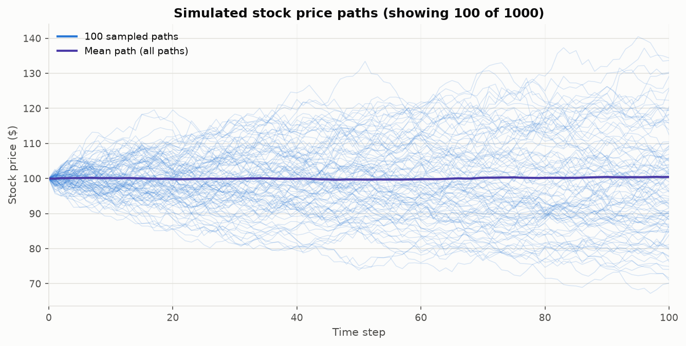
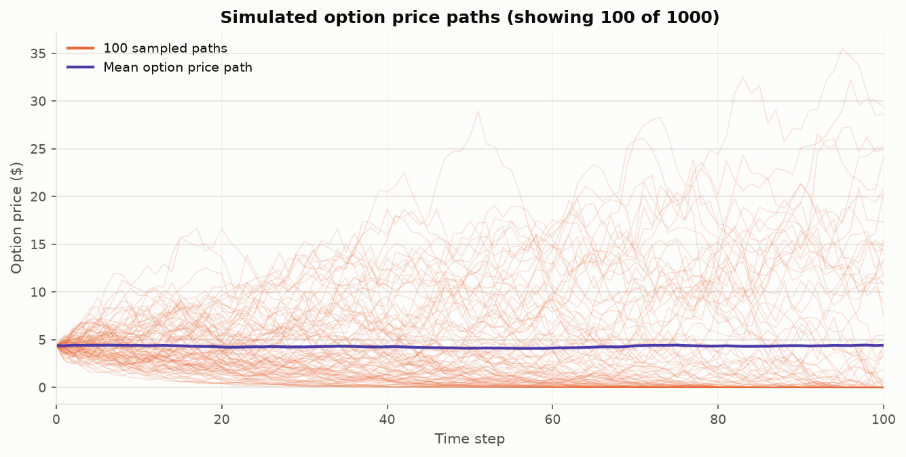
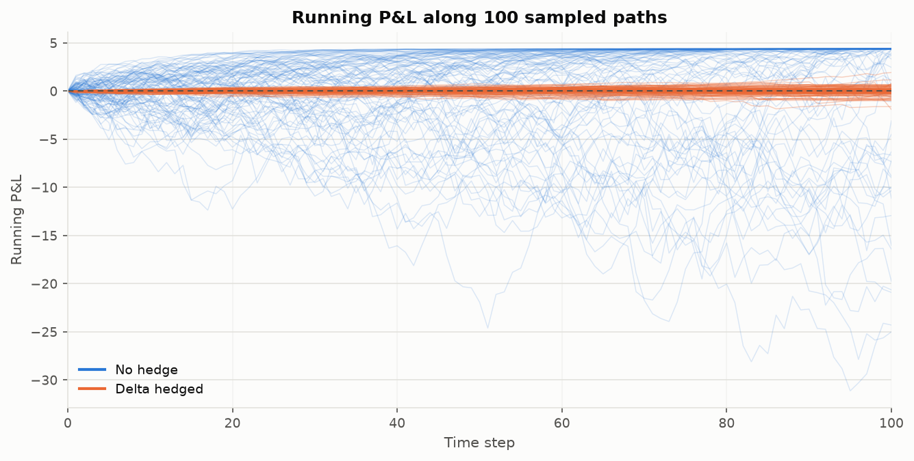
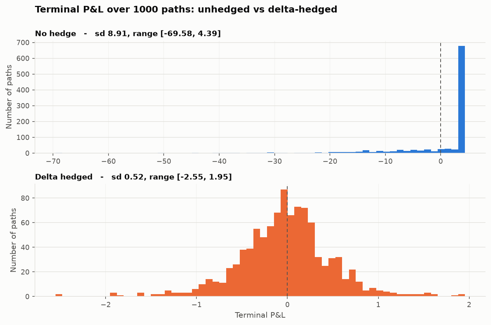
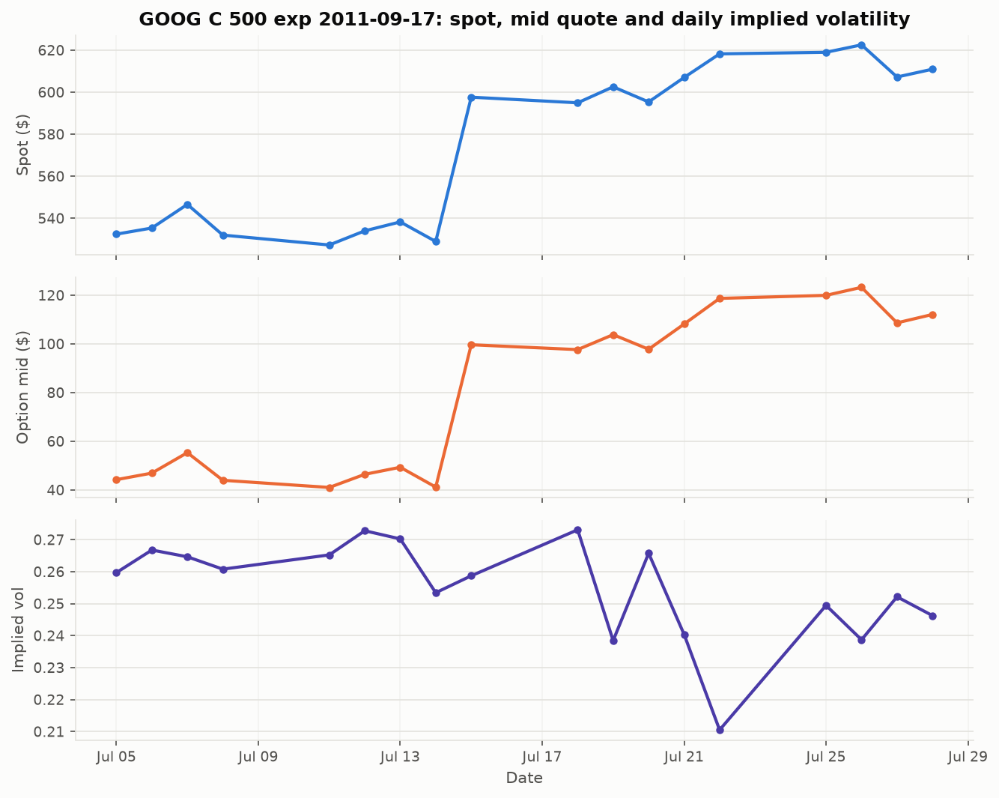
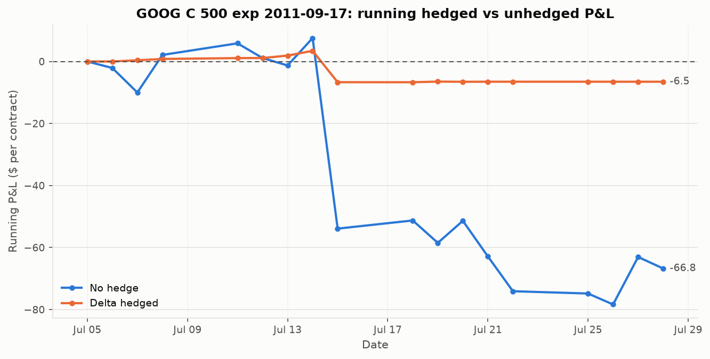

# Dynamic Delta Hedging - Results

Python implementation of the interim project originally written in C++.
Every number and figure below is produced by `python run_all.py`; nothing is
hand-entered.

| | |
| --- | --- |
| Package | `ddh/` (option, pricing, pnl, simulation, market_data, plotting, tasks) |
| Entry point | `run_all.py` |
| Raw outputs | `output/*.csv`, `output/figures/*.png` |
| Task 1 seed | `42` (results are reproducible) |

---

## 1. Task 1 - Option pricing and P&L on simulated paths

### 1.1 Objective

Simulate stock price paths, compute the P&L of a short European call with and
without a delta hedge, and store the results for analysis.

### 1.2 Methodology

1. **Option.** Strike `K = 105`, spot `S0 = 100`, rate `r = 0.025`, maturity `T = 0.4`, volatility `sigma = 0.24`, `100` time steps.
2. **Simulation.** `StockPriceSimulator` draws `1000` geometric Brownian
   motion paths using the exact log-Euler scheme
   `S[i+1] = S[i] * exp((r - sigma^2/2) * dt + sigma * sqrt(dt) * Z)` and writes
   them to `output/stock_paths.csv`.
3. **Pricing and P&L.** `OptionPricer` marks the call at every step with time to
   maturity running linearly from `T` to `0`; `PnLCalculator` then produces
   both the delta-hedging error and the unhedged buy-and-hold P&L.
4. **Storage.** `output/option_prices.csv` and `output/pnl_results_task1.csv`.

The self-financing hedge is rolled forward as

```
B[0] = V[0] - Delta[0] * S[0]
B[i] = B[i-1] * exp(r * dt) - (Delta[i] - Delta[i-1]) * S[i]
HE[i] = Delta[i] * S[i] + B[i] - V[i]        (hedging error)
PnL[i] = V[0] - V[i]                         (no hedge)
```

The option is sold at its model value `V0 = 4.3917` with
initial delta `0.4287`.

### 1.3 Summary statistics

| Statistic | Stock Price | Option Price |
| --- | --- | --- |
| Overall Mean | 100.03 | 4.29 |
| Overall Std Dev | 11.03 | 5.57 |
| Overall Min | 55.86 | 0.00 |
| Overall Max | 178.97 | 73.97 |
| Mean Final | 100.44 | 4.42 |
| Std Dev Final | 15.96 | 8.91 |

*Simulated stock and option prices across 1000 paths x 101 observation points.*

### 1.4 Stock price and option price evolution



*Figure 1: simulated stock price paths. The mean across all 1000 paths drifts up at the risk-free rate.*



*Figure 2: option price evolution. The mean is close to flat - under the
risk-neutral drift used here the option's expected value grows only at the
risk-free rate - while individual paths split between expiring worthless and
converging on their intrinsic value.*

### 1.5 Task 1 P&L results

| Statistic | PnL without Hedge | Hedging Error PnL |
| --- | --- | --- |
| Mean | -0.03 | -0.02 |
| Standard Deviation | 8.91 | 0.52 |
| Minimum | -69.58 | -2.55 |
| Maximum | 4.39 | 1.95 |

*Terminal P&L of the two strategies over the simulated paths.*



*Figure 3: running P&L along sampled paths. The unhedged position fans out with
the underlying; the hedged position stays in a narrow band.*



*Figure 4: terminal P&L distributions. The unhedged short call has a long left
tail; the hedging error is tight and centred near zero.*

**Observations**

- The unhedged short call is heavily skewed: capped upside at the premium
  received (`4.39`) against a worst path
  of `-69.58`.
- Delta hedging cuts the terminal standard deviation from `8.91`
  to `0.52` - a reduction of `94.2%`.
- The residual hedging error has a mean near zero: what is left is discretisation
  error from rebalancing only 100 times, not a directional bet.

---

## 2. Task 2 - Hedging P&L with market data

### 2.1 Objective

Evaluate the hedging performance of a GOOG call using historical spot
prices, interest rates and option quotes: back out a daily implied volatility
and compare hedged against unhedged P&L.

### 2.2 Data sources

| File | Contents |
| --- | --- |
| `sec_GOOG.csv` | daily adjusted closing spot prices |
| `interest.csv` | daily risk-free rates (percent) |
| `op_GOOG.csv` | option quotes: date, expiry, type, strike, bid, ask |

### 2.3 Parameters

| Parameter | Value |
| --- | --- |
| Observation window | 2011-07-05 to 2011-07-28 (18 trading days; window end 2011-07-29 is exclusive, as in the C++ run) |
| Expiry | 2011-09-17 |
| Strike | 500 |
| Option type | Call |
| Initial volatility guess | 0.2 |
| Initial maturity | 53 trading days = 0.210317 years |

### 2.4 Methodology

1. Load spot, rate and quote data and align them by date.
2. Take the mid-market price `(best_bid + best_offer) / 2` as the observed price.
3. Back out a daily implied volatility by binary search on the BSM price.
4. Run `PnLCalculator` along the realised spot path with the daily implied
   volatility and daily rate.
5. Write `output/task2_results.csv`.

### 2.5 Results

| Date | Spot | Market Mid | Implied Vol | Delta | PnL No Hedge | PnL Hedge |
| --- | --- | --- | --- | --- | --- | --- |
| 2011-07-05 | 532.4400 | 44.2000 | 0.2597 | 0.7227 | 0.0000 | 0.0000 |
| 2011-07-06 | 535.3600 | 46.9000 | 0.2668 | 0.7381 | -2.0887 | 0.0134 |
| 2011-07-07 | 546.6000 | 55.3000 | 0.2646 | 0.7993 | -9.9995 | 0.3903 |
| 2011-07-08 | 531.9900 | 43.9500 | 0.2608 | 0.7341 | 2.1146 | 0.8166 |
| 2011-07-11 | 527.2800 | 41.0000 | 0.2652 | 0.7093 | 5.8587 | 1.0956 |
| 2011-07-12 | 534.0100 | 46.4000 | 0.2728 | 0.7501 | 1.1163 | 1.1199 |
| 2011-07-13 | 538.2600 | 49.3000 | 0.2702 | 0.7827 | -1.2815 | 1.9021 |
| 2011-07-14 | 528.9400 | 41.1500 | 0.2534 | 0.7476 | 7.5601 | 3.4410 |
| 2011-07-15 | 597.6200 | 99.6500 | 0.2587 | 0.9804 | -53.8974 | -6.6789 |
| 2011-07-18 | 594.9400 | 97.6500 | 0.2731 | 0.9777 | -51.2687 | -6.6869 |
| 2011-07-19 | 602.5500 | 103.8000 | 0.2384 | 0.9953 | -58.4956 | -6.4824 |
| 2011-07-20 | 595.3500 | 97.8000 | 0.2657 | 0.9903 | -51.3800 | -6.5436 |
| 2011-07-21 | 606.9900 | 108.1500 | 0.2404 | 0.9990 | -62.8713 | -6.5199 |
| 2011-07-22 | 618.2300 | 118.7000 | 0.2105 | 1.0000 | -74.0885 | -6.5212 |
| 2011-07-25 | 618.9800 | 119.9500 | 0.2494 | 1.0000 | -74.8270 | -6.5222 |
| 2011-07-26 | 622.5200 | 123.2500 | 0.2387 | 1.0000 | -78.3568 | -6.5247 |
| 2011-07-27 | 607.2200 | 108.6500 | 0.2521 | 1.0000 | -63.0445 | -6.5256 |
| 2011-07-28 | 610.9400 | 112.1000 | 0.2462 | 1.0000 | -66.7523 | -6.5265 |

*Daily results; P&L figures are running totals from the first day.*



*Figure 5: spot, option mid quote and daily implied volatility. Three measures on
three scales get three panels sharing the date axis.*



*Figure 6: running hedged and unhedged P&L on the realised path.*

**Observations**

- GOOG gapped up roughly 13% on 2011-07-15 (earnings). The naked short call lost `61.5` that day;
  the hedged book lost `10.1`.
- Over the whole window the unhedged P&L travels a range of `85.9`
  against `10.1` for the hedged book, ending at `-66.8`
  versus `-6.5`.
- Daily implied volatility ranges from `0.2105` to `0.2731`.
- Delta hedging removes most, but not all, of the loss. A single overnight gap is
  exactly the risk a delta hedge cannot neutralise: the hedge is linear, the
  payoff is not, and the position is only rebalanced once a day.
- Practical caveat: this run charges no transaction costs and assumes fills at the
  close. Both would erode the hedged result further.

### 2.6 Cross-check against the original C++ report

`reference/report_interim_task2.csv` holds the Task 2 table as printed in
`report_interim.pdf`. The Python port reproduces it:

| Quantity | Max absolute difference |
| --- | --- |
| Daily implied volatility | 4.72e-07 |
| PnL no hedge | 0.0183 |
| PnL hedge | 0.0162 |

The implied volatilities agree to every digit the report prints. The residual
P&L differences are consistent with the tolerance of the C++ bisection: the
reported volatilities are rounded to six figures, and the P&L is a difference
of option prices whose vega is of order 50, so a 1e-6 volatility error moves
the P&L by a few hundredths.

### 2.7 Maturity convention

The original C++ run had two quirks in how time to maturity was handled, kept
here behind flags in `Task2Config` so the legacy numbers remain reproducible:

- `iv_uses_initial_maturity` - every day's implied volatility was solved
  against the *initial* 53-day maturity
  rather than the days actually left.
- `compress_maturity_to_window` - inside the hedging loop the option's entire
  remaining life was compressed into the observation window, so it was marked
  as if expiring on the last observed day.

Setting both to `False` uses the true days to expiry throughout. The
comparison:

| | Report convention | True maturity |
| --- | --- | --- |
| Implied vol, first day | 0.2597 | 0.2597 |
| Implied vol, last day | 0.2462 | 0.3027 |
| Final PnL no hedge | -66.75 | -67.90 |
| Final PnL hedge | -6.53 | -11.20 |

The qualitative conclusion is unchanged - the hedge still absorbs the bulk of
the move - but the compressed convention overstates time decay and therefore
the size of both P&L series.

---

## 3. Code overview

The C++ classes map one-to-one onto Python modules:

| C++ class | Python | Role |
| --- | --- | --- |
| `Option` | `ddh/option.py` | immutable contract parameters (`K`, `S`, `r`, `T`, `sigma`) |
| `Option_Price` | `ddh/pricing.py` | BSM price and delta, implied volatility by binary search, vectorised grid pricer |
| `PNL_Calculator` | `ddh/pnl.py` | self-financing hedge recursion, hedged and unhedged P&L |
| `Stock_Price_Simulator` | `ddh/simulation.py` | GBM path generation |
| `Path_Saver` | `ddh/storage.py` | CSV output |
| - | `ddh/market_data.py` | loads and aligns the three market CSVs |
| - | `ddh/plotting.py` | figures |
| - | `ddh/stats.py` | summary statistics |
| `task1.cpp` | `ddh/task1.py` | simulated-path experiment |
| `task2.cpp` | `ddh/task2.py` | market-data experiment |
| - | `ddh/report.py` | renders this file |

Two differences from the C++ original are worth calling out. Pricing is
vectorised over paths with NumPy, so all 1000 x 101 marks are
computed in a handful of array operations rather than a double loop. And
configuration lives in `ddh/config.py` dataclasses rather than being hard-coded
in `main`.

### Reproducing

```bash
pip install -r requirements.txt
python run_all.py                            # regenerates output/ and this file
python -m unittest discover -s tests -t .    # 14 unit tests
```

The test suite covers put-call parity, delta against a finite difference,
implied-volatility round trips, the risk-neutral drift of the simulator, the
`1/sqrt(n)` decay of the hedging error, and the cross-check in section 2.6.
